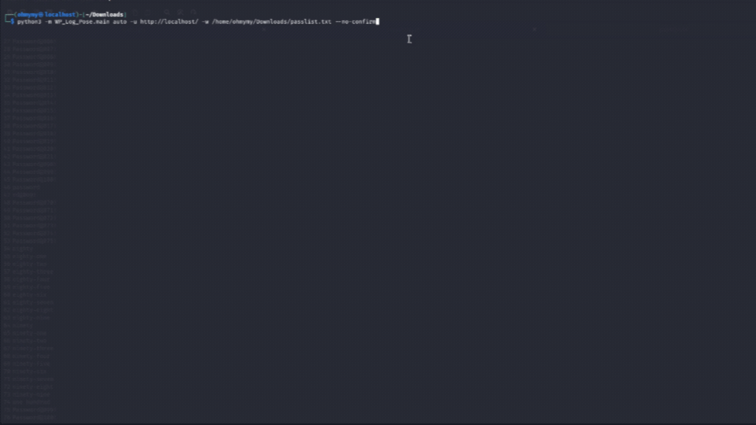

# WordPress Website Testing Tool
**Version: 2.0 — Author: Mr.valentine (NAYAN) "don't miind the name "**



```
 ██     ██ ██████  ██       ██████   ██████  ██████   ██████  ███████ ███████ 
 ██     ██ ██   ██ ██      ██    ██ ██       ██   ██ ██    ██ ██      ██      
 ██  █  ██ ██████  ██      ██    ██ ██   ███ ██████  ██    ██ ███████ █████   
 ██ ███ ██ ██      ██      ██    ██ ██    ██ ██      ██    ██      ██ ██      
  ███ ███  ██      ███████  ██████   ██████  ██       ██████  ███████ ███████ 
```

# WP_Log_Pose
### WordPress Testing Toolkit

[](https://python.org)
[](LICENSE)
[](https://linux.org)
[](https://github.com)

*by Mr.valentine(NAYAN) — "don't mind the name"*

**For authorised security testing only.**

</div>

---

## ⚠️ Legal Disclaimer

> This tool is strictly for **authorised penetration testing and security research**.
> You must have **explicit written permission** from the target system owner before use.
> Unauthorised use may violate computer fraud laws in your jurisdiction.
> The author assumes **zero liability** for any misuse of this tool.

---

## 📖 Table of Contents

- [Overview](#-overview)
- [Features](#-features)
- [Installation](#-installation)
- [Quick Start](#-quick-start)
- [Commands](#-commands)
  - [enumerate](#enumerate)
  - [vuln](#vuln)
  - [bruteforce](#bruteforce)
  - [auto](#auto)
- [Options](#-options)
- [Output Formats](#-output-formats)
- [Examples](#-examples)
- [File Structure](#-file-structure)

---

## 🔍 Overview

WP_Log_Pose is a modular WordPress security testing toolkit. It combines user enumeration, vulnerability scanning, and credential brute-forcing into a single unified command-line interface.

---

## ✨ Features

| Feature | Description |
|---|---|
| 👤 **User Enumeration** | 4 independent methods — REST API, author archives, oEmbed, sitemap |
| 🛡️ **Vulnerability Scanner** | 10 passive checks — headers, debug.log, XML-RPC, path disclosure, and more |
| 🔓 **Brute-force** | Threaded attacks via XML-RPC, wp-login.php, and REST API |
| 🤖 **Auto Mode** | Detects available vectors and attacks automatically |
| 📊 **5 Output Formats** | txt, json, csv, html, markdown |
| ⚡ **Fast & Threaded** | Concurrent requests with cooperative cancellation |
| 💾 **Memory Efficient** | Streams wordlists — never loads full file into RAM |

---

## 📦 Installation

### Requirements

```
Python 3.10+
requests
urllib3
```
## Install dependencies

**Kali Linux / Debian:**
```bash
pip install requests urllib3 --break-system-packages
```

**Other Linux / macOS:**
```bash
pip install requests urllib3
```

### Setup

```bash
# Clone or download the repository
git clone https://github.com/yourusername/WP_Log_Pose.git
cd WP_Log_Pose/..

# Run directly as a module from the parent directory
python3 -m WP_Log_Pose.main --help
```

> ⚠️ **Important:** Always run from the **parent directory** of `WP_Log_Pose/`, not from inside it.

### Optional — Add a shell alias

```bash
echo 'alias wlp="python3 -m WP_Log_Pose.main"' >> ~/.bashrc
source ~/.bashrc

# Then just use:
wlp enumerate -u https://target.com
```

---

## 🚀 Quick Start

```bash
cd ~/Downloads

# 1 — Enumerate usernames
python3 -m WP_Log_Pose.main enumerate -u https://target.com --no-confirm

# 2 — Run vulnerability scan
python3 -m WP_Log_Pose.main vuln -u https://target.com --no-confirm

# 3 — Brute-force with found users
python3 -m WP_Log_Pose.main bruteforce \
  -u https://target.com \
  -w wordlist.txt \
  -U users.txt \
  --no-confirm

# 4 — Let the tool do everything automatically
python3 -m WP_Log_Pose.main auto \
  -u https://target.com \
  -w wordlist.txt \
  --no-confirm
```

---

## 📋 Commands

### `enumerate`

Discovers WordPress usernames using 4 independent methods.

```bash
python3 -m WP_Log_Pose.main enumerate -u <URL> [options]
```

**Methods used:**

| Method | Endpoint | Description |
|---|---|---|
| REST API | `/wp-json/wp/v2/users` | Fetches public user list |
| Author Archives | `/?author=1..20` | Follows redirects to extract slugs |
| oEmbed | `/wp-json/oembed/1.0/embed` | Extracts author name from metadata |
| Sitemap | `/sitemap.xml` | Parses XML for `/author/` URLs |

**Example:**
```bash
python3 -m WP_Log_Pose.main enumerate \
  -u https://target.com \
  --no-confirm \
  -v
```

**Output:**
```
  >>  User Enumeration
  --------------------

  [+]  2 user(s) discovered:

       admin    [REST, AUTHOR]
       editor   [REST]

  [+]  Saved -> users.txt
```

---

### `vuln`

Runs a passive vulnerability and misconfiguration scan.

```bash
python3 -m WP_Log_Pose.main vuln -u <URL> [options]
```

**Checks performed:**

| Check | Severity | Description |
|---|---|---|
| Security Headers | HIGH–LOW | CSP, X-Frame-Options, HSTS, etc. |
| Directory Listing | MEDIUM | Open indexes on sensitive paths |
| debug.log | HIGH | PHP debug log publicly readable |
| XML-RPC | HIGH | xmlrpc.php enabled with multicall |
| REST API Users | MEDIUM | Username list exposed without auth |
| Path Disclosure | LOW | Filesystem paths in PHP errors |
| Sensitive Files | CRITICAL | .env, wp-config.php.bak, .git/HEAD |
| wp-cron.php | LOW | Publicly invocable cron endpoint |
| Version Leak | INFO | WordPress version in generator tag |
| Login Hardening | INFO | Default login URL, no rate-limiting |

**Example:**
```bash
python3 -m WP_Log_Pose.main vuln \
  -u https://target.com \
  --no-confirm \
  --output report.html \
  --format html
```

---

### `bruteforce`

Credential brute-force using one or all attack modes.

```bash
python3 -m WP_Log_Pose.main bruteforce \
  -u <URL> \
  -w <wordlist> \
  -U <usernames> \
  -m <mode> \
  [options]
```

**Modes:**

| Mode | Endpoint | Method |
|---|---|---|
| `xmlrpc` | `/xmlrpc.php` | `wp.getUsersBlogs` per thread |
| `wplogin` | `/wp-login.php` | Form POST with cookie detection |
| `restapi` | `/wp-json/wp/v2/users/me` | HTTP Basic Auth |
| `all` | All of the above | Tries each in order, stops on first hit |

**Example:**
```bash
python3 -m WP_Log_Pose.main bruteforce \
  -u https://target.com \
  -w /usr/share/wordlists/rockyou.txt \
  -U users.txt \
  -m xmlrpc \
  --threads 10 \
  --delay 0 \
  --no-confirm
```

**Output:**
```
[XMLRPC] Endpoint confirmed ✅  starting attack...
[XMLRPC] Attacking 'admin'  threads=10
  [XMLRPC] user=admin  tested=   150  [████████████░░░░░░░░░░░░░░░░░░░░░░░░░░░░]

  [!!!] SUCCESS  admin:password123
```

---

### `auto`

Detects all available attack vectors, enumerates users if needed, and attacks automatically using the best available method.

```bash
python3 -m WP_Log_Pose.main auto \
  -u <URL> \
  -w <wordlist> \
  [options]
```

**Attack priority:** XML-RPC → REST API → wp-login.php

**With `--safe`:** Runs vulnerability scan only — no brute-force.

**Example:**
```bash
python3 -m WP_Log_Pose.main auto \
  -u https://target.com \
  -w rockyou.txt \
  --threads 15 \
  --no-confirm \
  --output results.html \
  --format html
```

---

## ⚙️ Options

| Option | Short | Default | Description |
|---|---|---|---|
| `--url` | `-u` | required | Target WordPress URL |
| `--wordlist` | `-w` | — | Path to password wordlist |
| `--usernames` | `-U` | — | Path to username list |
| `--mode` | `-m` | `all` | Attack mode: `xmlrpc` `wplogin` `restapi` `all` |
| `--threads` | — | `10` | Concurrent worker threads |
| `--delay` | — | `0.0` | Seconds between request chunks |
| `--timeout` | — | `15` | HTTP socket timeout |
| `--proxy` | — | — | Proxy URL e.g. `socks5h://127.0.0.1:9050` |
| `--output` | — | — | Save results to file |
| `--format` | — | `txt` | Output format: `txt json csv html md` |
| `--safe` | — | False | Scan only, no brute-force |
| `--config` | — | — | JSON config file |
| `--no-confirm` | — | False | Skip authorisation prompt |
| `--verbose` | `-v` | 0 | `-v` INFO, `-vv` DEBUG |

---

## 📄 Output Formats

| Format | Command | Best for |
|---|---|---|
| `txt` | `--format txt` | Piping to other tools |
| `json` | `--format json` | Automation, scripting |
| `csv` | `--format csv` | Excel, Splunk, SIEM |
| `html` | `--format html` | Client reports |
| `md` | `--format md` | GitHub issues, wikis |

**Generate an HTML report:**
```bash
python3 -m WP_Log_Pose.main vuln \
  -u https://target.com \
  --no-confirm \
  --output report.html \
  --format html
```

---

## 💡 Examples

**Full pentest workflow:**
```bash
TARGET="https://target.com"
WORDLIST="/usr/share/wordlists/rockyou.txt"

# Step 1 — Find users
python3 -m WP_Log_Pose.main enumerate -u $TARGET --no-confirm

# Step 2 — Scan for vulnerabilities
python3 -m WP_Log_Pose.main vuln -u $TARGET --no-confirm --output vuln.html --format html

# Step 3 — Brute-force
python3 -m WP_Log_Pose.main bruteforce \
  -u $TARGET -w $WORDLIST -U users.txt \
  -m all --threads 10 --no-confirm \
  --output creds.json --format json
```

**Behind a proxy:**
```bash
# Burp Suite
python3 -m WP_Log_Pose.main vuln -u https://target.com \
  --proxy http://127.0.0.1:8080 --no-confirm

# Tor
python3 -m WP_Log_Pose.main enumerate -u https://target.com \
  --proxy socks5h://127.0.0.1:9050 --no-confirm
```

**Safe mode — scan only:**
```bash
python3 -m WP_Log_Pose.main auto \
  -u https://target.com \
  --safe --no-confirm \
  --output scan.html --format html
```

**Verbose debug output:**
```bash
python3 -m WP_Log_Pose.main enumerate \
  -u https://target.com \
  --no-confirm -vv 2>debug.log
```

---

## 📁 File Structure

```
WP_Log_Pose/
├── __init__.py          Package init
├── main.py              CLI entry point
├── config.py            Defaults and config loader
├── core_http.py         HTTP session and request helpers
├── base.py              Abstract base class
├── enumeration.py       User enumeration (4 methods)
├── vuln_scanner.py      Vulnerability scanner (10 checks)
├── reporting.py         Console output and file writers
└── attacks/
    ├── __init__.py
    ├── xmlrpc.py        XML-RPC brute-force
    ├── wplogin.py       wp-login.php brute-force
    └── restapi.py       REST API brute-force
```

---

## Safety & legal

This tool is for **authorized security testing only**. Do not run it against systems you do not own or have explicit permission to test. I’m not responsible for misuse.

---
📜 License

This project is licensed under the [MIT License](LICENSE). Feel free to use, modify, and distribute it as needed.
